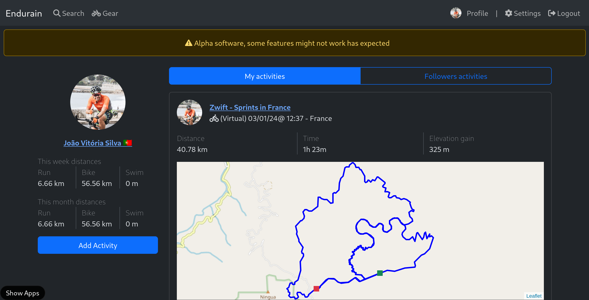

  

  # Endurain

  
  
  
  

  **A self-hosted fitness tracking service**  
  Visit Endurain's [Mastodon profile](https://fosstodon.org/@endurain) and [Discord server](https://discord.gg/6VUjUq2uZR).

  

## Table of Contents

- [Endurain documentation](https://docs.endurain.com)
- [What is Endurain?](#what-is-endurain)
- [Endurain screenshots](https://docs.endurain.com/gallery/)
- [Sponsors](#sponsors)
- [Contributing](#contributing)
- [Help Translate](#help-translate)
- [License](#license)

## What is Endurain?

Endurain is a self-hosted fitness tracking service designed to give users full control over their data and hosting environment. It's similar to Strava but focused on privacy and customization. Built with:

- **Frontend:** Vue.js, Notivue and Bootstrap CSS
- **Backend:** Python FastAPI, Alembic, SQLAlchemy, stravalib and python-garminconnect for Strava and Garmin Connect integration, gpxpy, tcxreader and fitdecode for .gpx, .tcx and .fit file import respectively
- **Database:** MariaDB or PostgreSQL for efficient data management
- **Observability:** Jaeger for basic tracing and monitoring
- **Integrations:** Supports Strava and Garmin Connect. Manual upload of activities using .gpx, .tcx and .fit files are also supported

To deploy Endurain, a Docker image is available, and a comprehensive example can be found in the "docker-compose.yml.example" file provided. Configuration is facilitated through environment variables, ensuring flexibility and ease of customization.

For more information please see the Endurain's [documentation](https://docs.endurain.com).

## Sponsors

A huge thank you to the project sponsors! Your support helps keep this project going.

Consider [sponsoring Endurain on GitHub](https://github.com/sponsors/joaovitoriasilva) to ensure continuous development.

## Contributing

Contributions are welcomed! Please open an issue to discuss any changes or improvements before submitting a PR. Check out the [Contributing Guidelines](CONTRIBUTING.md) for more details.

## Help Translate

Endurain has multi-language support, and you can help translate it into more languages via [Crowdin](https://crowdin.com/project/endurain). 

## License

This project is licensed under the AGPL-3.0 License - see the [LICENSE](LICENSE) file for details.