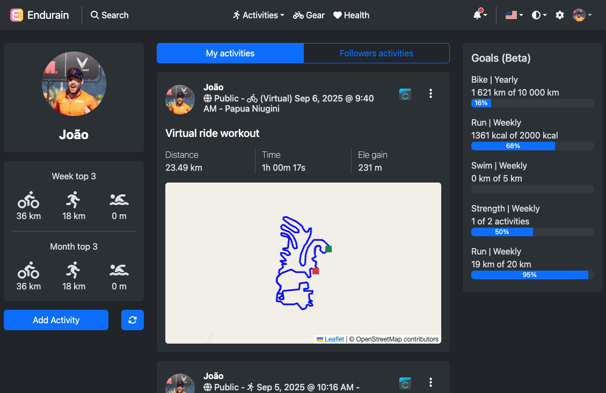

  

  # Endurain

  

  A self-hosted fitness tracking service • Endurain <a href="https://fosstodon.org/@endurain">Mastodon</a> profile

  

> [!WARNING]
> This project is currently in **Alpha** state. You can try it out at your own risk, but be aware that things might break and **DATA LOSS** may occur.

Endurain is a self-hosted fitness tracking service that operates much like Strava but allows users to have complete control over their data and the hosting environment. The application's frontend is built using Vue.js and Bootstrap CSS. On the backend, it leverages Python FastAPI, Alembic, SQLAlchemy, stravalib and gpxpy for seamless integration with Strava and .gpx file import. The MariaDB database engine is employed to efficiently store and manage user data, while Jaeger is used for basic observability.

To deploy Endurain, Docker images are available, and a comprehensive example can be found in the "docker-compose.yml.example" file provided. Configuration is facilitated through environment variables, ensuring flexibility and ease of customization.

As a non-professional developer, my journey with Endurain involved learning and implementing new technologies and concepts, with invaluable assistance from ChatGPT. The primary motivation behind this project was to gain hands-on experience and expand my understanding of modern development practices. Second motivation is that I'm an amateur triathlete and I want to keep track of my gear and gear components usage.

If you have any recommendations or insights on improving any aspect of Endurain, whether related to technology choices, user experience, or any other relevant area, I would greatly appreciate your input. The goal is to create a reliable and user-friendly fitness tracking solution that caters to the needs of individuals who prefer self-hosted applications. Your constructive feedback will undoubtedly contribute to the refinement of Endurain.

Default credentials are:
 - User: admin
 - Password: admin

Currently the service supports:
 - Multi-user
 - Create/edit/delete users
 - Basic admin and regular user profiles that adapt the interface
 - Import activities using .gpx files
 - Bulk import for activity files
 - Connect with Strava and retrieve activities and gear from Strava
 - Feed with user activities, current user week stats and month stats
 - Feed with followers activities
 - Basic activity privacy
 - Activity page with more in depth info of the activity
 - Delete activities
 - Create/edit/delete gear (wetsuit, bicycle and running shoes)
 - Add/edit/delete activity gear
 - User page with user stats and user activities per week
 - Follow user basic implementation
 - Multi-language support, but currently only English is available
 - Basic gear tracking usage
 - Theme switcher (dark, light and auto)
 - 3rd party apps

To do features (not by order):
 - Support import of .fit files
 - Default gear for activity type
 - Gear components logic for component usage tracking
 - Comments and likes logic for activities
 - Notifications logic
 - Activity Pub integration?

# Integrate with your application
Endurain starting on version 0.3.0 supports multiple app types. For web applications the backend will return the access and refresh tokens as http only cookies, for mobile it will return them in the response.
To support this in your implementation you will need to:
 - Add a "X-Client-Type" header to every request with the "web" or "mobile" value. Every other value will return a 403. This will be needed for token creation and refresh logic but also for every other endpoint token validation/expiration logic
 - For activity upload currently only the "/activities/create/upload" endpoint is available and it expects a .gpx file

# Frontend
Table bellow shows supported environment variables. Variables marked with optional "No" should be set to avoid errors.

Environemnt variable  | Default value | Optional | Notes
--- | --- | --- | ---
MY_APP_BACKEND_PROTOCOL | http | Yes | Needs to be https if you want to enable Strava integration. Strava callback relies on this. You may need to update this variable based on docker image spin up (api host or local ip (example: http://192.168.1.10:98))
MY_APP_BACKEND_HOST | localhost:98 | Yes | Needs to be set and be Internet faced/resolved if you want to enable Strava integration. Strava callback relies on this. You may need to update this variable based on docker image spin up (api host or local ip (example: http://192.168.1.10:98))
MY_APP_STRAVA_CLIENT_ID | changeme | Yes | Needs to be set with your Strava API Client ID if you want to enable Strava integration.

Frontend dependencies:
 - To check npm dependencies used, use npm file (package.json)
 - User avatars create using DiceBear (https://www.dicebear.com) avataaars style.
 - Logo created on Canva

# Backend
Table bellow shows supported environment variables. Variables marked with optional "No" should be set to avoid errors.

Environemnt variable  | Default value | Optional | Notes
--- | --- | --- | ---
DB_HOST | mariadb | Yes | N/A
DB_PORT | 3306 | Yes | N/A
DB_USER | endurain | Yes | N/A
DB_PASSWORD | changeme | `No` | N/A
DB_DATABASE | endurain | Yes | N/A
SECRET_KEY | changeme | `No` | Run "openssl rand -hex 32" on a terminal to get a secret
ALGORITHM | HS256 | Yes | Currently only HS256 is supported
ACCESS_TOKEN_EXPIRE_MINUTES | 15 | Yes | Time in minutes
REFRESH_TOKEN_EXPIRE_DAYS | 7 | Yes | Time in days
STRAVA_CLIENT_ID | changeme | `No` | Needed if you want to enable the Strava integration
STRAVA_CLIENT_SECRET | changeme | `No` | Needed if you want to enable the Strava integration
STRAVA_AUTH_CODE | changeme | `No` | Needed if you want to enable the Strava integration
JAEGER_ENABLED | false | Yes | N/A
JAEGER_PROTOCOL | http | Yes | N/A
JAEGER_HOST | jaeger | Yes | N/A
JAGGER_PORT | 4317 | Yes | N/A
STRAVA_DAYS_ACTIVITIES_ONLINK | 30 | Yes | On Strava integration setup the number of days (including today) to get activities. Strava free API limitations can limit number of days you can query in a given time
FRONTEND_PROTOCOL | http | Yes | Needs to be set if you want to enable Strava integration. You may need to update this variable based on docker image spin up (frontend host or local ip (example: http://192.168.1.10:8080))
FRONTEND_HOST | frontend:8080 | Yes | Needs to be set if you want to enable Strava integration. You may need to update this variable based on docker image spin up (frontend host or local ip (example: http://192.168.1.10:8080))
GEOCODES_MAPS_API | changeme | `No` | <a href="https://geocode.maps.co/">Geocode maps</a> offers a free plan consisting of 1 Request/Second. Registration necessary.

Table bellow shows the obligatory environemnt variables for mariadb container. You should set them based on what was also set for backend container.

Environemnt variable  | Default value | Optional | Notes
--- | --- | --- | ---
MYSQL_ROOT_PASSWORD | changeme | `No` | N/A
MYSQL_DATABASE | endurain | `No` | N/A
MYSQL_USER | endurain | `No` | N/A
MYSQL_PASSWORD | changeme | `No` | N/A

Table bellow shows the volumes available to be configured. Not obligatory, but recommended:

Volume | Path | Notes
--- | --- | ---
/app | <local_path>/endurain/backend/app:/app | Configure volume if you want to edit the code locally by cloning the repo and comment next line
/app/user_images | <local_path>/endurain/backend/app/user_images:/app/user_images | Necessary for user image persistence on container image updates
/app/bulk_import | <local_path>/endurain/backend/bulkimport | Necessary to enable bulk import of activities. Place here your activities files

To check Python backend dependencies used, use poetry file (pyproject.toml)

# Strava integration
For Strava integration API endpoint must be available to the Internet.
You will also need to create a API Application using a Strava account -> more info here https://developers.strava.com/docs/getting-started/

# Sponsors
A huge thank you to this project sponsor(s)! Your support is greatly appreciated and helps drive the continued development and improvement of this project.

If you find this project useful, please consider [sponsoring it on GitHub](https://github.com/sponsors/joaovitoriasilva). Your support will help ensure its continued development and maintenance.

Thank you to all, sponsors and contributors, who make this project possible!