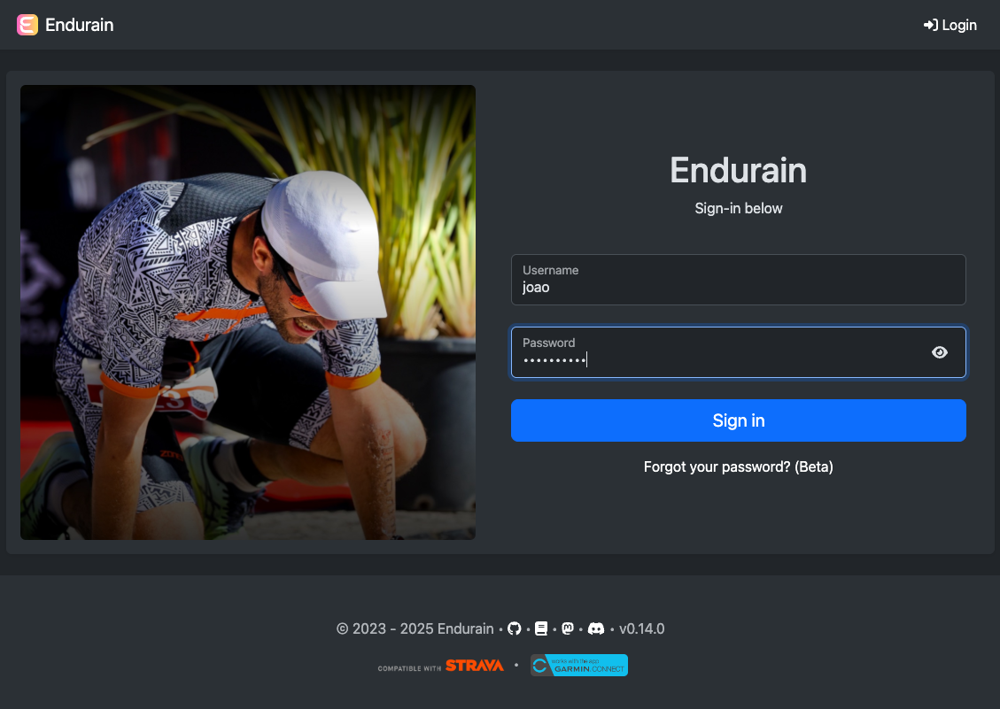
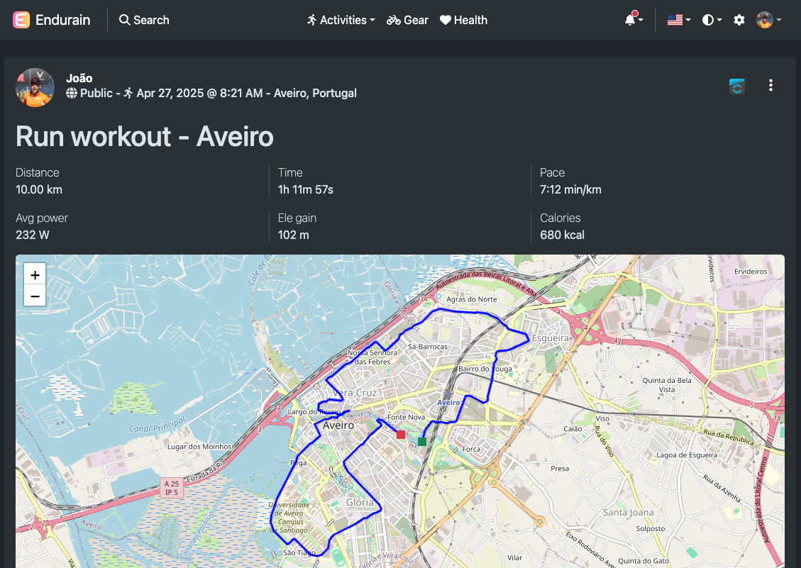
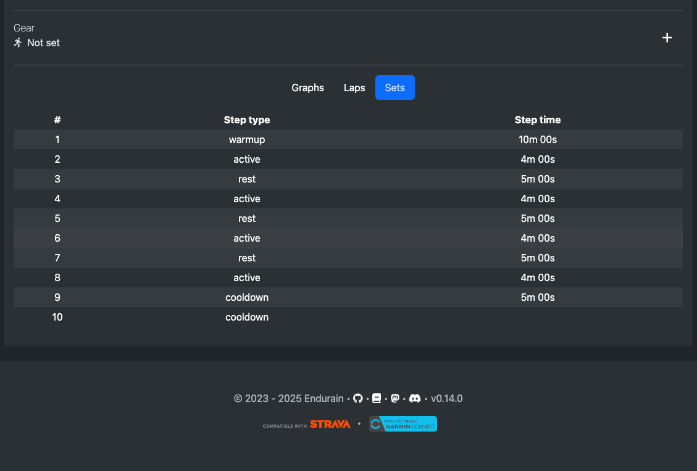
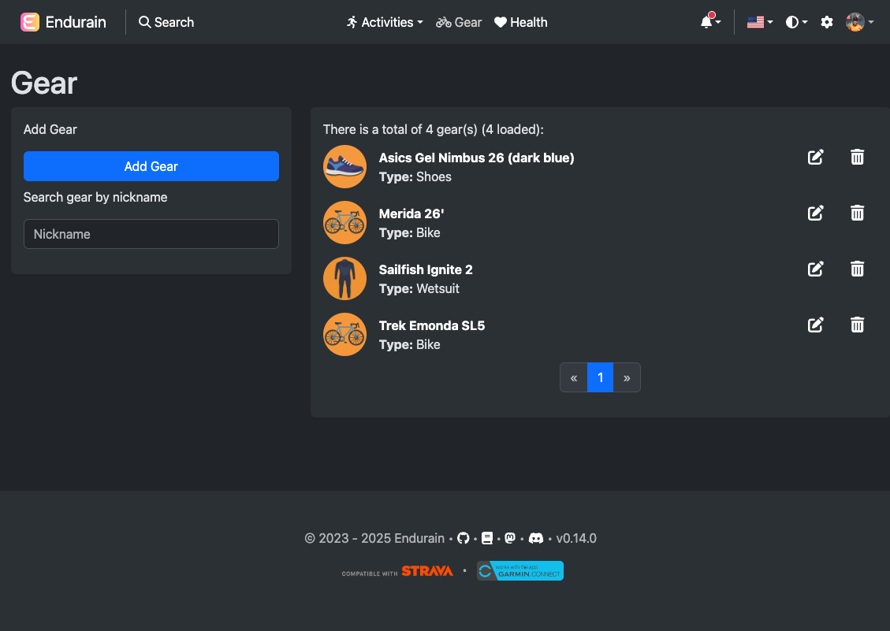
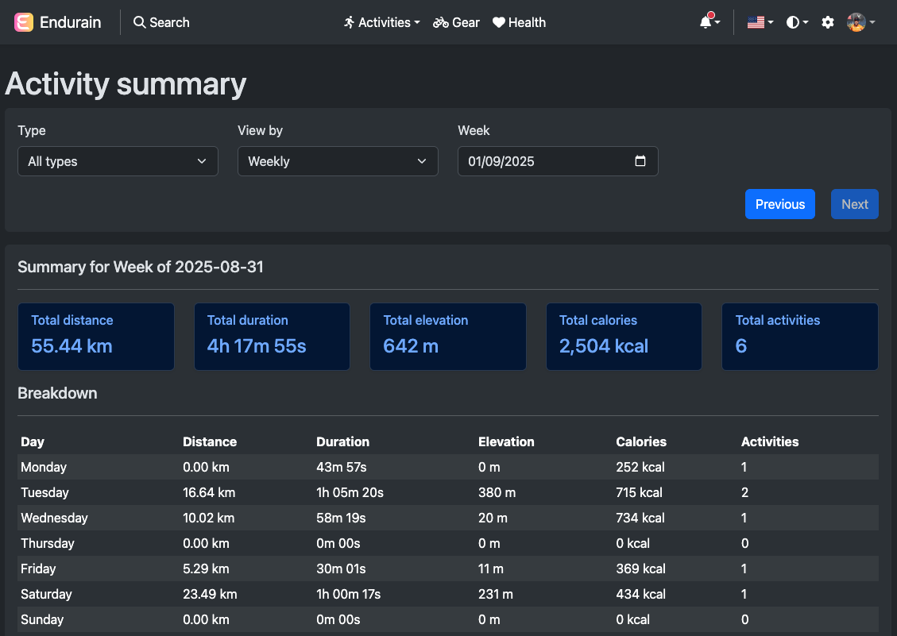
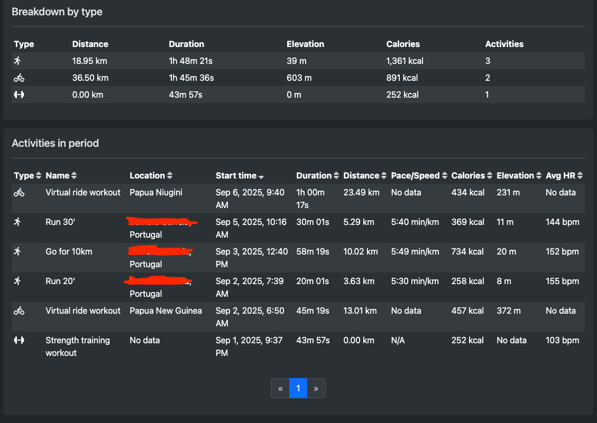
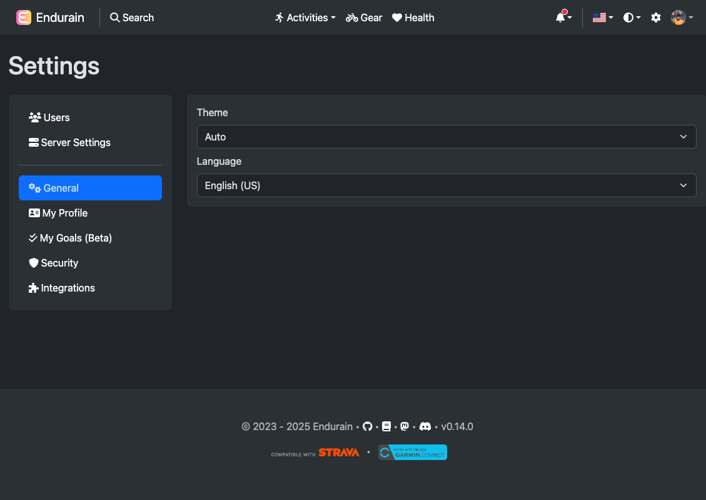
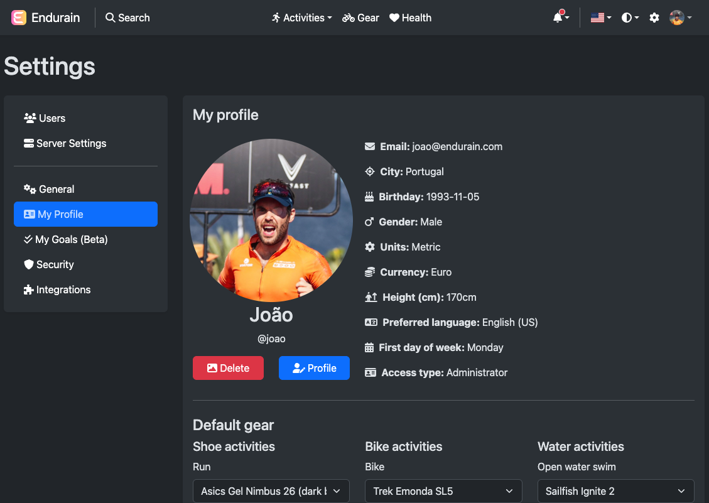
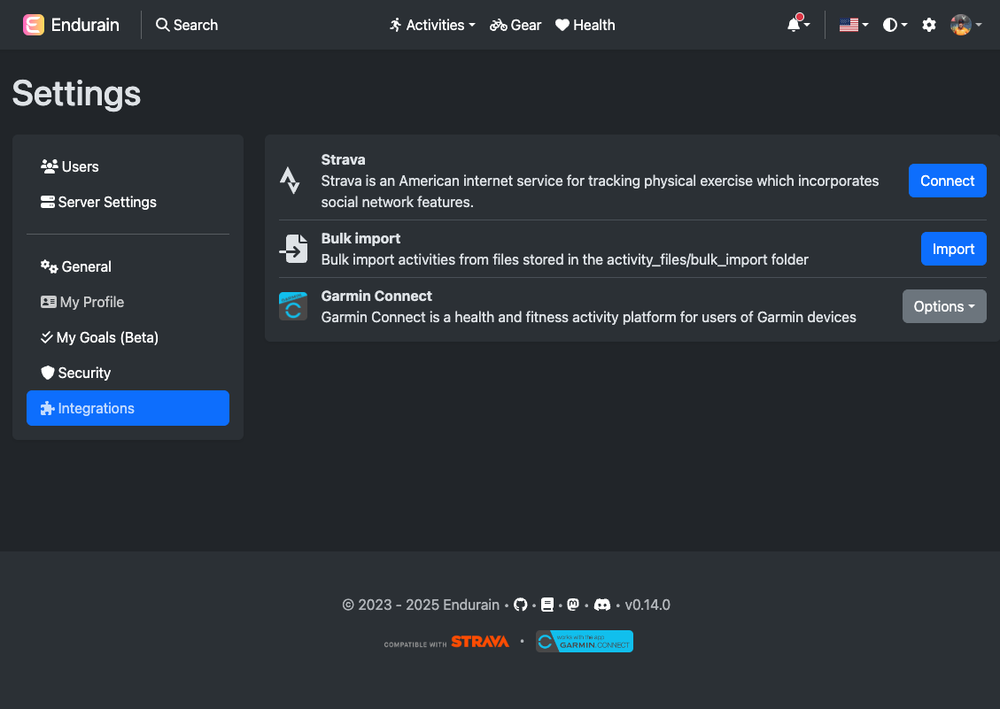

# Gallery

---

##### Login page
** Image can be changed **

##### Home page

##### Search page

##### Activity page

##### Activities pages

##### Gears pages

##### Health pages

##### Summary page

##### Profile page

##### Settings pages

** Users administrator and server settings pages only visible to admin users **

