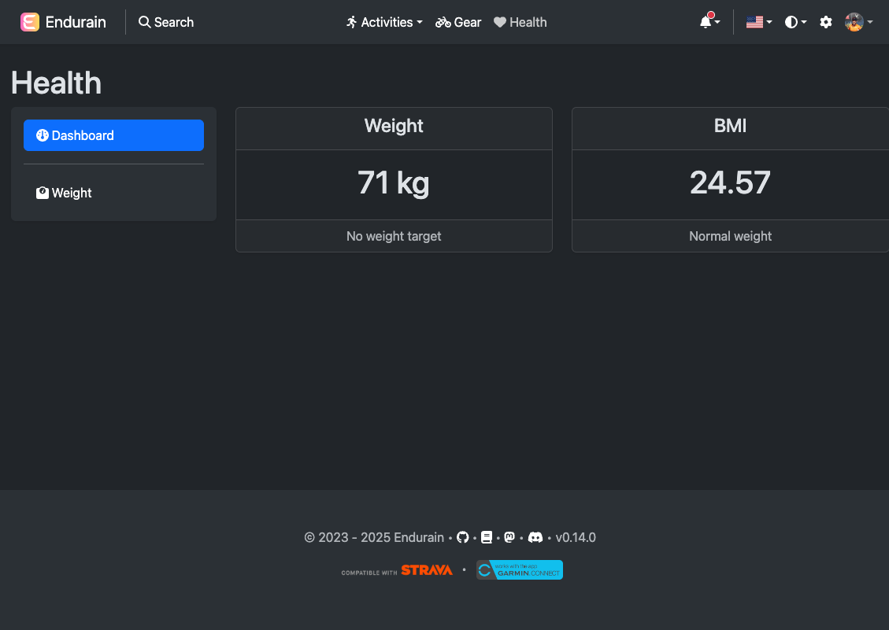
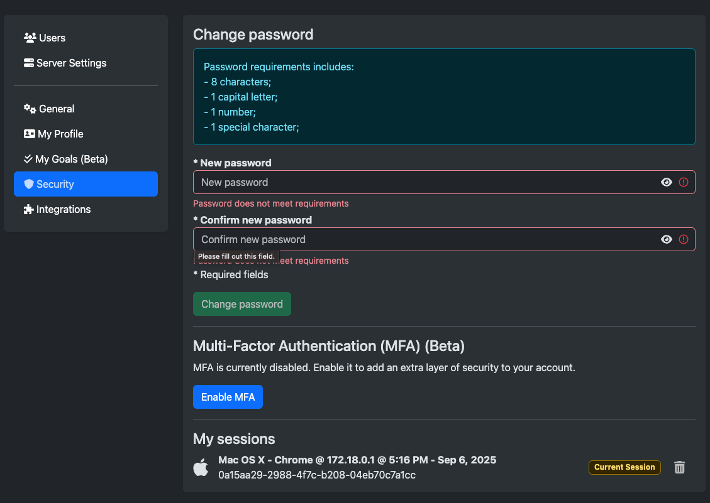

# Gallery

---

  
Home page

  

    
  

  
Activity page

  

    
  

  

    
  

  
Gears page

  

    
  

  

    
  

  
Health page

  

    
  

  

    
  

  
Profile page

  

    
  

  
Settings page

  

    
  

  

    
  

  

    
  

  

    
  

  

    
  

